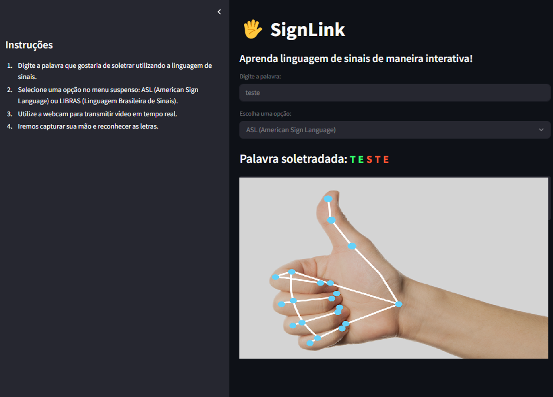

# **Aplicação SignLink**



O código desenvolvido neste diretório cria uma aplicação web utilizando da biblioteca streamlit.
A simples aplicação recebe do usuário uma palavra, a qual será soletrada por meio do uso de linguagem de sinais.  
A partir da captura da imagem da webcam do usuário, são extraídos as marcações das mãos (caso estejam aparecerendo na tela), enviando para um modelo de detecção de linguagem de sinais (WIP). 
Assim que o usuário finaliza todas as letras desta palavra, o aprendizado se encerra, apresentando uma mensagem de parabenização.

### **Como rodar**
Para rodar esta aplicação, **é necessário ter Docker instalado e que ele esteja aberto.**
A partir dos seguintes comandos, todos os requisitos (dentro do código *requirements.txt* serão baixados), e você poderá visualizar a aplicação rodando localmente, na URL: http://localhost:8501

Clone o repositório
```
git clone https://github.com/gruporaia/SignLink-dev.git
```

Após clonar o repositório, navegue até a pasta **/app** (onde está o Dockerfile)
```
cd app
```

Criando uma Docker image com os requisitos do programa
```
docker build -t signlink:latest .
```

Rodando um container com a imagem criada
```
docker run -p 8501:8501 signlink:latest
```
