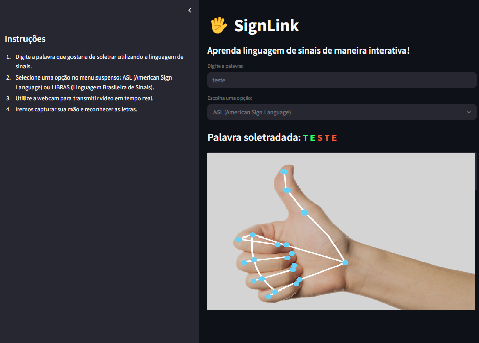
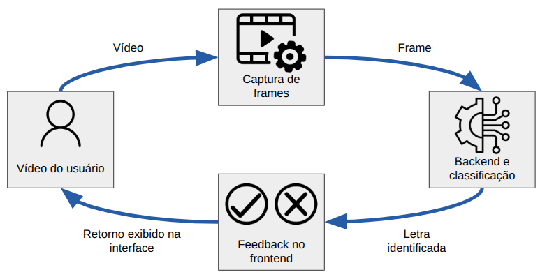
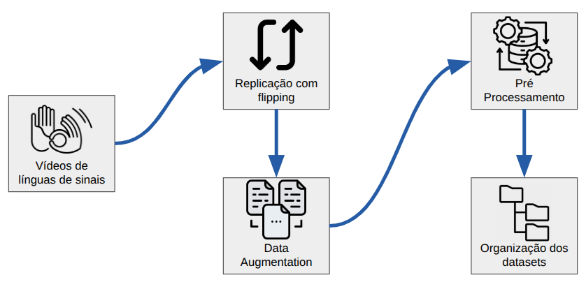
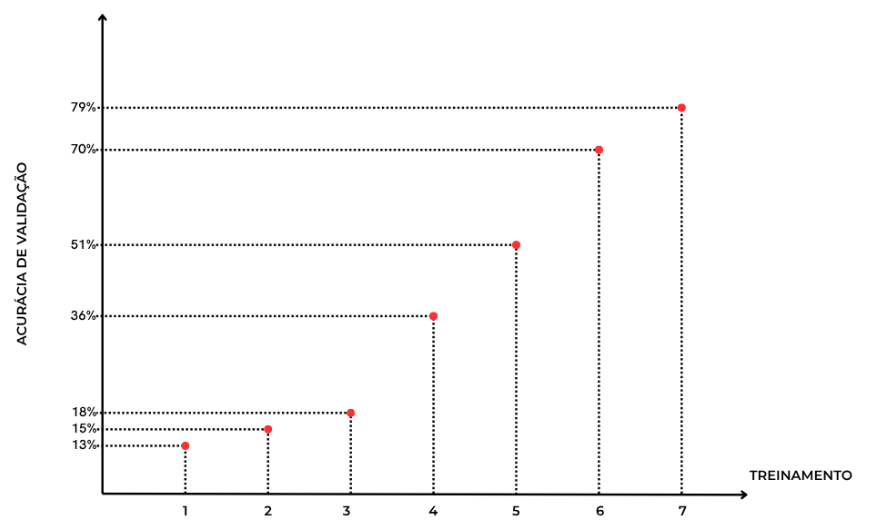

# **SpellNet**

Este projeto propõe o desenvolvimento de uma aplicação para o reconhecimento de _fingerspelling_ em tempo real, compatível com múltiplas línguas de sinais — especificamente LIBRAS e ASL nesta aplicação. A iniciativa busca suprir a escassez de ferramentas interativas voltadas ao ensino e prática de línguas de sinais, promovendo acessibilidade e inclusão por meio de uma experiência instrutiva e dinâmica. O projeto foi desenvolvido em parceria com a startup SignLink.



## ⚙️ Funcionamento

### Aplicação

A aplicação é estruturada como um sistema _web_ desenvolvido em **Python**, com interface construída por meio do _framework_ **Streamlit**. O objetivo é permitir que o usuário selecione uma língua de sinais (LIBRAS ou ASL), insira uma palavra e pratique sua soletração em tempo real por meio da **webcam**.

O funcionamento da aplicação segue o seguinte fluxo:

1. **Captura de vídeo**  
   O vídeo do usuário é capturado _frame a frame_ utilizando a biblioteca **OpenCV**.

2. **Extração de landmarks**  
   Cada _frame_ é processado com o módulo **MediaPipe Hands**, que extrai as _landmarks_ das mãos. Essas informações são combinadas à imagem para auxiliar a classificação.

3. **Classificação**  
   O _frame_ e suas _landmarks_ são enviados ao _backend_, que executa o modelo correspondente à língua selecionada. O modelo classifica o gesto correspondente à letra.

4. **Validação e feedback**  
   A letra prevista é exibida na interface como _feedback_ ao usuário. Em caso de acerto, a letra é validada como parte da palavra.

---

### Datasets

Os modelos foram treinados com **datasets autorais**, compostos por vídeos gravados via webcam pelos próprios membros do projeto, representando os alfabetos de LIBRAS e ASL. Essa abordagem simula o ambiente real de uso da aplicação e contribui para a robustez dos modelos.

Durante o **pré-processamento**, as imagens são normalizadas, redimensionadas e combinadas com _landmarks_ extraídas. Para melhorar a generalização, foram aplicadas técnicas de _data augmentation_ como:

- Rotação
- Alterações de iluminação e saturação
- Adição de _salt and pepper noise_

O pipeline completo de pré-processamento e funcionamento da aplicação é ilustrado nos diagramas abaixo:

  
*Figura 1 – Pipeline da aplicação*

  
*Figura 2 – Pipeline de dados*

---

### 🧠 Modelagem

Os modelos utilizados para a classificação dos gestos são redes neurais convolucionais (CNNs) **MobileNet**, treinadas a partir da técnica de _feature extraction_ Essa abordagem permite o aproveitamento de conhecimento prévio de modelos pré-treinados, evitando o treinamento completo e reduzindo o risco de _overfitting_, além de garantir desempenho adequado para a tarefa realizada, ainda que com datasets menores.

O treinamento foi realizado sobre os _datasets_ autorais descritos anteriormente, e avaliado por meio de _cross-validation_ estratificada por intérprete: as divisões entre treinamento e validação foram feitas garantindo que os vídeos de um mesmo intérprete não estivessem presentes em ambos os conjuntos. Essa metodologia assegura uma avaliação mais realista da capacidade de generalização dos modelos, essencial para uma aplicação voltada a múltiplos usuários.

---

A aplicação interativa permite que o usuário insira uma palavra, que será então soletrada utilizando linguagem de sinais. A cada _frame_ capturado da webcam, a imagem é processada para extrair as _landmarks_ das mãos, que são repassadas ao modelo correspondente à língua selecionada (LIBRAS ou ASL). Conforme as letras são corretamente identificadas, a palavra é construída e, ao final, o usuário recebe uma mensagem de conclusão como forma de incentivo.


### **Como executar**
Para rodar esta aplicação, **é necessário ter Docker instalado e, em caso de Docker Desktop, que ele esteja aberto.**
A partir dos seguintes comandos, todos os requisitos (dentro do código *requirements.txt* serão baixados), e você poderá visualizar a aplicação rodando localmente, na URL: http://localhost:8501

Clone o repositório
```
git clone https://github.com/gruporaia/SignLink-dev.git
```

Após clonar o repositório, navegue até a pasta **/app** (onde está o Dockerfile)
```
cd app
```

Criando uma Docker image com os requisitos do programa
```
docker build -t signlink:latest .
```

Rodando um container com a imagem criada
```
docker run -p 8501:8501 signlink:latest
```

## 📊 Resultados

O projeto resultou no desenvolvimento de uma aplicação funcional para o reconhecimento de _fingerspelling_ em LIBRAS e ASL, validada por meio de testes com usuários externos e pela técnica de _cross-validation_. Dentre os principais resultados, destacam-se:

- Plataforma interativa para prática de _fingerspelling_, com suporte a gestos estáticos dos alfabetos de LIBRAS e ASL.
- Conjuntos de dados autorais com 3.700 imagens por classe (LIBRAS) e 5.000 imagens por classe (ASL), suprindo a escassez de _datasets_ públicos voltados a este cenário.
- Modelos treinados com acurácias de **90% (LIBRAS)** e **79% (ASL)** nos testes de _cross-validation_.
- Metodologia reprodutível e eficaz, servindo como prova de conceito para projetos similares.

O gráfico a seguir mostra a acurácia do modelo de ASL ao longo de sete iterações de treinamento. As duas primeiras utilizaram _datasets_ públicos ([link]), enquanto as demais foram geradas a partir de diferentes estratégias de pré-processamento dos vídeos. A última iteração utiliza o _pipeline_ completo descrito neste repositório.

  

[Clique aqui para acessar o vídeo de demonstração da aplicação](./demo_asl.mp4)

### Próximos passos

- Implementar e integrar redes LSTM para reconhecimento de gestos sequenciais, expandindo o reconhecimento além de imagens estáticas.  
- Explorar arquiteturas que unam CNNs com LSTMs para capturar tanto características espaciais quanto temporais dos sinais.  
- Avaliar mecanismos para aprimorar a experiência do usuário.
- Investigar a combinação de diferentes técnicas de aprendizado e processamento (escala de cor, profundidade, etc.) para aprimorar a capacidade de generalização dos modelos.

## 📚 Referências

Ismael Júnior Santos Borges, Nara Vitória Santiago da Silva, e Zilma Cardoso Barros Soares. *Uma revisão bibliográfica acerca do uso da tecnologia no processo de ensino e aprendizagem de alunos surdos*. Revista de Ensino e Aprendizagem, 2022.

Celiane do Lago Novaes Côrtes. *Importância da Língua de Sinais e do Intérprete para a aquisição da linguagem: um estudo de caso*. Revista Educação Pública, 2024.

Rohan Gupta et al. *Sign Language Recognition using VGG16 and ResNet50*. Proceedings of the Conference on Sign Language Recognition, 2024.

Anik Nur Handayani et al. *Comparison of ResNet-50 and EfficientNet-B0 Method for Classification of Indonesian Sign Language System (SIBI) Using Multi Background Dataset*. Proceedings of the IEEE Conference on Sign Language Recognition, 2024.

Byeongkeun Kang, Subarna Tripathi e Truong Q. Nguyen. *Real-Time Sign Language Fingerspelling Recognition Using Convolutional Neural Networks from Depth Map*. 2015 3rd IAPR Asian Conference on Pattern Recognition (ACPR), 2015.

Abiodun Oguntimilehin e Kolade Balogun. *Real-Time Sign Language Fingerspelling Recognition using Convolutional Neural Network*. Proceedings of [Nome da Conferência, se disponível], 2023.

Hongwen Pu e Keyi Yi. *A Comparative Analysis of EfficientNet and MobileNet Models’ Performance on Limited Datasets: An Example of American Sign Language Alphabet Detection*. Highlights in Science, Engineering and Technology, 2024.

Sivamohan S. et al. *Hand Gesture Recognition and Translation for International Sign Language Communication using Convolutional Neural Networks*. Proceedings of the 2024 2nd International Conference on Advancement in Computation & Computer Technologies (InCACCT), 2024.
**OpenCV** – [https://opencv.org](https://opencv.org)

**MediaPipe Hands** – [https://developers.google.com/mediapipe/solutions/vision/hand_landmarker](https://developers.google.com/mediapipe/solutions/vision/hand_landmarker)

**MobileNet** – [https://arxiv.org/abs/1704.04861](https://arxiv.org/abs/1704.04861)

## 💻 Quem somos
|  |  Este projeto foi desenvolvido pelos membros do **RAIA (Rede de Avanço de Inteligência Artificial)**, uma iniciativa estudantil do Instituto de Ciências Matemáticas e de Computação (ICMC) da USP - São Carlos. Somos estudantes que compartilham o objetivo de criar soluções inovadoras utilizando inteligência artificial para impactar positivamente a sociedade. Para saber mais, acesse [nosso site](https://gruporaia.vercel.app/) ou [nosso Instagram](instagram.com/grupo.raia)! |
|------------------|-------------------------------------------|

---

### 🤝 Parceria
|  |  Este projeto foi desenvolvido em colaboração com a **SignLink**, uma startup brasileira encubada pela StartFellowship dedicada à promoção da acessibilidade e inclusão por meio do desenvolvimento de tecnologias para a comunicação em Línguas de Sinais. Para saber mais, acesse o [site](https://signlinkproject.github.io/index.html) ou o [LinkedIn](https://br.linkedin.com/company/sign-link-project)! |
|------------------|-------------------------------------------|

### Desenvolvedores
- **Cecilia Sedenho** - [LinkedIn](https://br.linkedin.com/in/cec%C3%ADlia-nunes-sedenho-305059255/pt) | [GitHub](https://github.com/HeNunes)
- **Joao Pedro Viguini** - [LinkedIn](https://br.linkedin.com/in/jo%C3%A3o-pedro-viguini-1829281bb) | [GitHub](https://github.com/jpviguini)
- **Daniel Carvalho** - [LinkedIn](https://br.linkedin.com/in/daniel-carvalho-aba61717a) | [GitHub](https://github.com/danielcarvalho99)
- **Bernardo Marques** - [LinkedIn](https://br.linkedin.com/in/bernardo-marques-costa) | [GitHub](https://github.com/bmarquescost)
- **Gabriel Iamato** - [LinkedIn](https://br.linkedin.com/in/gabriel-campanelli-iamato) | [GitHub](https://github.com/GabrielIamato)
- **Matheus Vicente** - [LinkedIn](https://br.linkedin.com/in/matheushrv) | [GitHub](https://github.com/MatheusHRV)

